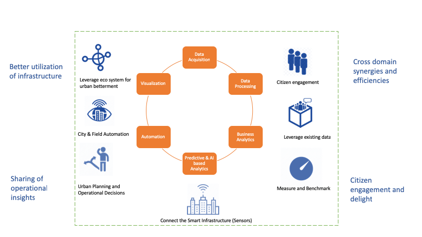

***********************
Atlantis: Documentation
***********************
:ref:`Atlantis` documentation is intended for the users and developers of the Atlantis Platform.

This documentation is *constantly updated*
`Read the docs <http://atlantisdocs.readthedocs.org/>`_

Atlantis Platform
=================
Atlantis is a purposely-built urban infrastructure decision platform, the platform incorporates best practices and learnings from implementing multiple cities across the globe. The platform enables you to rapidly build and deploy smartcity solutions in a secure fashion.

How does it help cities transform to smartcities ?
--------------------------------------------------
The platform simplifies the key aspects related to the digital transformation of cities from data acquisition to the citizen engagement.

*Some of the key capabilities of the platform:-*

* Connect and harvest the data from multiple digital assets like IOT Sensors, IT, OT (Scada) and opendata into the city data platform
* Use informational insights to drive city operations in an autonomous fashion using :ref:`Automation Engine`  and :ref:`Recommendation Engine`
* Measure and track key operational and performance metrics
* Provides recommendations and insights to help in better urban planning, improving the efficiency & effectiveness of the urban operations while reducing the operational costs
* Engage citizen feedback and make urban services more accessible to citizens

    
    

.. _intro-docs:

.. toctree::
   :maxdepth: 3
   :hidden:
   :caption: Getting Started

   Atlantis
   AutomationEngine
   RecommendationEngine

.. _dev-docs:

.. toctree::
   :maxdepth: 3
   :caption: Developer Documentation

   AtlantisDSL 
   DeploymentArchitecture

.. help-docs:

.. toctree::
   :maxdepth: 4
   :caption: Reference Documentation

   ReSTTablesList
   RTD Theme <https://sphinx-rtd-theme.readthedocs.io/en/latest/>
